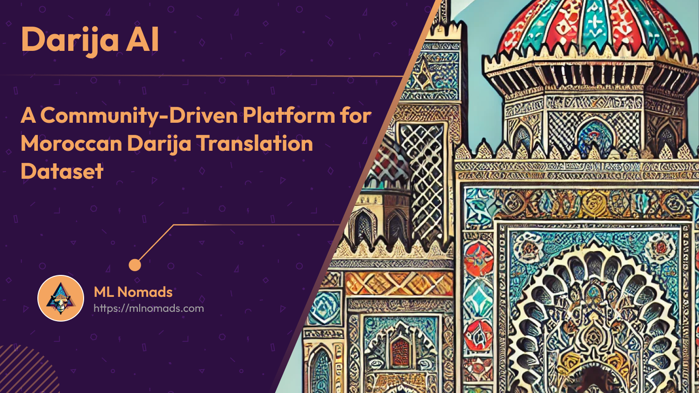
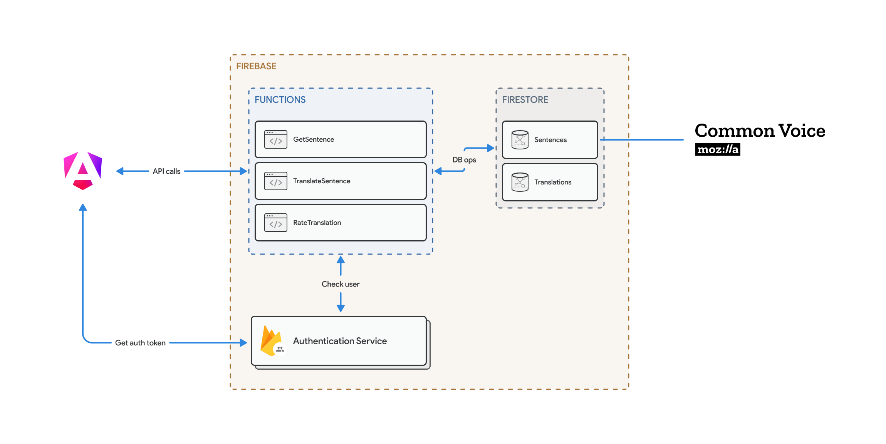
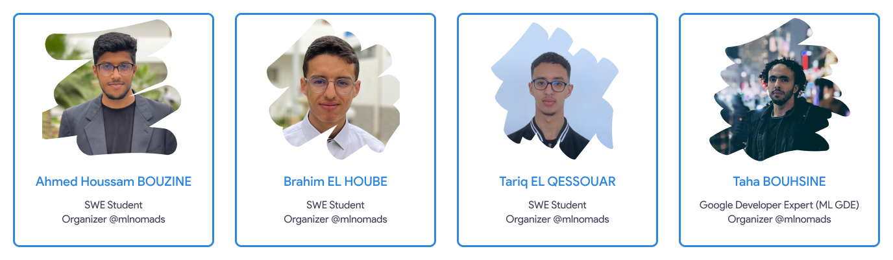

# #AISprint Darija AI: Crowdsourcing Moroccan Darija-English Translations

## About the Project

Darija AI is an innovative crowdsourcing platform designed to build a comprehensive Moroccan Darija-English translation dataset. Our goal is to address the challenges in creating high-quality datasets for minority languages, specifically Moroccan Darija, a unique dialect spoken by over 91% of Moroccan citizens.

**Project Link:** [https://darijaai.mlnomads.com](https://darijaai.mlnomads.com)

## Features

- **Translation**: Contributors can translate English phrases from the Mozilla Common Voice dataset into Moroccan Darija.
- **Peer Review**: Users can assess and rate previous translations, ensuring quality and accuracy.
- **Leaderboard**: A gamified system to recognize top contributors and encourage participation.
- **Flexible Input**: Support for both Arabic and Latin scripts, with no restrictions on regional dialects.

## Technical Architecture

The platform is built on a robust architecture designed to handle large volumes of data efficiently. We used Firebase to handle authentication, data processing, storage, and business logic, ensuring the system's robustness, security, and scalability.

This architecture leverages Firebase's serverless model, allowing for easy scaling and maintenance. The separation of concerns between frontend, backend functions, and data storage provides a modular and flexible system for handling sentence translations and ratings. By utilizing Firebase's integrated services, the platform can efficiently manage user authentication, data processing, and storage, ensuring a smooth and secure experience for contributors engaged in building the Moroccan Darija translation dataset.

## How to Contribute

### For Translators

1. Sign up at [https://darijaai.mlnomads.com](https://darijaai.mlnomads.com)
2. Start translating English phrases into Moroccan Darija
3. Participate in the peer review process to validate other translations

### For Developers

1. Fork this repository
2. Create your feature branch (`git checkout -b feature/AmazingFeature`)
3. Commit your changes (`git commit -m 'Add some AmazingFeature'`)
4. Push to the branch (`git push origin feature/AmazingFeature`)
5. Open a Pull Request

## The Team

- [Ahmed Houssam BOUZINE](https://ahmedhoussambouzine.com/) - Software Engineer
- [Tariq EL QESSOUAR](https://www.linkedin.com/in/elqessouartariq/) - Software Engineer
- [Brahim EL HOUBE](https://brahimelhoube.com/) - Software Engineer, data and cloud computing enthusiast
- [Taha BOUHSINE](https://www.tahabouhsine.com/) ([@tahabsn](https://hashnode.com/@tahabsn)) - ML/AI Google Developer Expert (Project Advisor)

## Acknowledgments

- Google AI/ML Developer Programs team for providing Google Cloud Credit for #AISprint
- All our contributors who have helped refine the platform and enhance the dataset

## License

Distributed under the GNU General Public License v3.0. See `LICENSE` for more information.

## Contact

For any queries, please open an issue on this repository.

---

Join us in preserving and advancing Moroccan Darija in the digital age!
